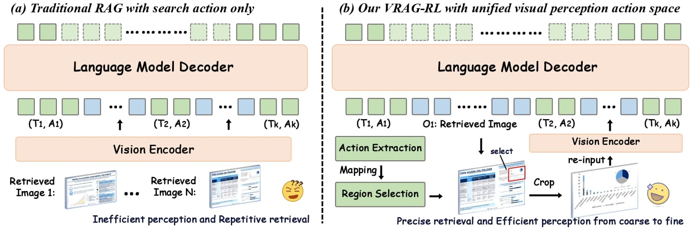
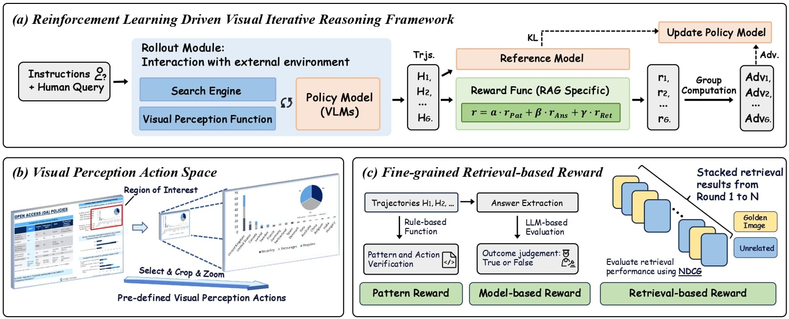

# <div align="center">✨VRAG: Moving Towards Next-Generation RAG<div>

<div align="center">
<!-- <h1>A Multi-round Multi-modal Reinforcement Learning Framework</h1> -->
<p><strong>Repo for "VRAG-RL: Empowering Vision-Perception-Based RAG for Visually Rich Information Understanding via Iterative Reasoning with Reinforcement Learning"</strong></p>
<a href="https://arxiv.org/pdf/2505.22019" target="_blank"></a>
<!-- <a href=''></a> -->
<a href="https://huggingface.co/autumncc/Qwen2.5-VL-7B-VRAG" target="_blank"></a>
</div>

<https://github.com/user-attachments/assets/86df27ca-7872-4327-9a76-8d6076970f62>

**⌛️ The project is still under ongoing development:**
- [x] Draft Demo
- [x] Model Release
- [ ] More Comprehensive Demo
- [ ] Training Code


## 🔥 News
- 🎉 We have released the demo, allowing you to customize your own VRAG.
<!-- - ⌛️ Training code will be released soon. -->
<!-- - 🎉 Our framework integrates various embedding models, enabling you to create your own retriever.
- 🎉 We have released the ViDoSeek dataset, which is suitable for Retrieval-augmented Generation in the large visually rich document collection. -->

## 🚀 Overview
- We introduce **VRAG**, a purely visual RAG agent that enables VLMs to progressively gather information from a coarse-grained to a fine-grained perspective.
- We propose **VRAG-RL**, a novel reinforcement learning framework tailored for training VLMs to effectively reason, retrieve, and understand visually rich information.
- We have released the **training framework** of VRAG-RL, a novel multi-turn and multimodal training framework with strong extensibility, capable of supporting training with various tools.

<div align="center">
<p align="center">
  
</p>
</div>

## 🔍 Quick Start

**Please refer to `run_demo.sh` to quickly start the demo.** Below is a step-by-step guide to help you run the demo on our example data:

### Dependencies
```bash
# Create environment
conda create -n vrag python=3.10
# Clone project
git clone https://github.com/alibaba-nlp/VRAG.git
cd VRAG
# Install requirements for demo only
pip install -r requirements.txt
```

### Run VRAG Demo

First, you need to launch the search engine, which utilizes the Colpali embedding model family. It is preferable to deploy the search engine independently on a single GPU.
```bash
## Deploy search engine server
python search_engine/search_engine_api.py
```
Then download the model and deploy the server using vllm. For a 7B model, it can be deployed on a single A100 80G GPU.
```bash
vllm serve autumncc/Qwen2.5-VL-7B-VRAG --port 8001 --host 0.0.0.0 --limit-mm-per-prompt image=10 --served-model-name Qwen/Qwen2.5-VL-7B-Instruct
```
Finally, use Streamlit to launch the demo.
```bash
streamlit run demo/app.py
```

## 💻 Build Your Own VRAG
Below is a step-by-step guide to help you run the VRAG on your own corpus, the entire process is divided into three steps: 
- The 1st and 2nd step are aimed at building your own purely vision-based search engine, 
- The 3rd step, similar to the quick start, is to launch the demo.

You should first convert your document to `.jpg` and store it in the `search_engine/corpus/img` with script `search_engine/corpus/pdf2images.py`. 

### Step1. Build the Index Database
Our framework is built on the foundation of the Llama-Index. We preprocess the corpus in advance and then establish an index database. 

Before embedding the whole dataset, you can run `./search_engine/vl_embedding.py` to check whether the embedding model is loaded correctly:
```python
# Test embedding model
python ./search_engine/vl_embedding.py
```
Then, you can run `ingestion.py` to embedding the whole dataset:
```python
# Document ingestion and Multi-Modal Embedding
python ./search_engine/ingestion.py
```

### Step2. Run Multi-Modal Retriever
Try using the search engine in `./search_engine/search_engine.py`:
```python
# initial engine
search_engine = SearchEngine(dataset_dir='search_engine/corpus', node_dir_prefix='colqwen_ingestion',embed_model_name='vidore/colqwen2-v1.0')
# Retrieve some results
recall_results = search_engine.batch_search(['some query A', 'some query B'])
```
Once the corpus and models for the search engine is prepared, you can directly run the search engine API server:
```bash
# run search engine server with fastapi
python search_engine/search_engine_api.py
```

### Step3. Run VRAG
Just like in the quick start guide, you can run the demo after deploying the VLM service:
```bash
vllm serve Qwen/Qwen2.5-VL-7B-Instruct --port 8001 --host 0.0.0.0 --limit-mm-per-prompt image=10 --served-model-name Qwen/Qwen2.5-VL-7B-Instruct
```
Use Streamlit to launch the demo.
```bash
streamlit run demo/app.py
```
Optionly, You can directly use our script for generation in `demo/vrag_agent.py` or you can integrate it into your own framework:
```python
from vrag_agent import VRAG
vrag = VRAG(base_url='http://0.0.0.0:8001/v1', search_url='http://0.0.0.0:8002/search', generator=False)
answer = vrag.run('What is the capital of France?')
```


## ⚙️ Train Model with VRAG-RL

<div align="center">
<p align="center">
  
</p>
</div>

Release Soon

<!-- ### Training Dependencies -->

<!-- ```bash
cd VRAG-RL
# Install requirements for training
pip install -r requirements.txt
# Install VRAG-RL
pip install -e .
```

### Step1. Prepare Data


### Step2. Build Training Corpus & Run Multi-Modal Search Engine


### Step3. Run RL Training with Qwen2.5-VL-Instruct. -->


## 📝 Citation

```bigquery
@misc{wang2025vragrlempowervisionperceptionbasedrag,
      title={VRAG-RL: Empower Vision-Perception-Based RAG for Visually Rich Information Understanding via Iterative Reasoning with Reinforcement Learning}, 
      author={Qiuchen Wang and Ruixue Ding and Yu Zeng and Zehui Chen and Lin Chen and Shihang Wang and Pengjun Xie and Fei Huang and Feng Zhao},
      year={2025},
      eprint={2505.22019},
      archivePrefix={arXiv},
      primaryClass={cs.CL},
      url={https://arxiv.org/abs/2505.22019}, 
}
```